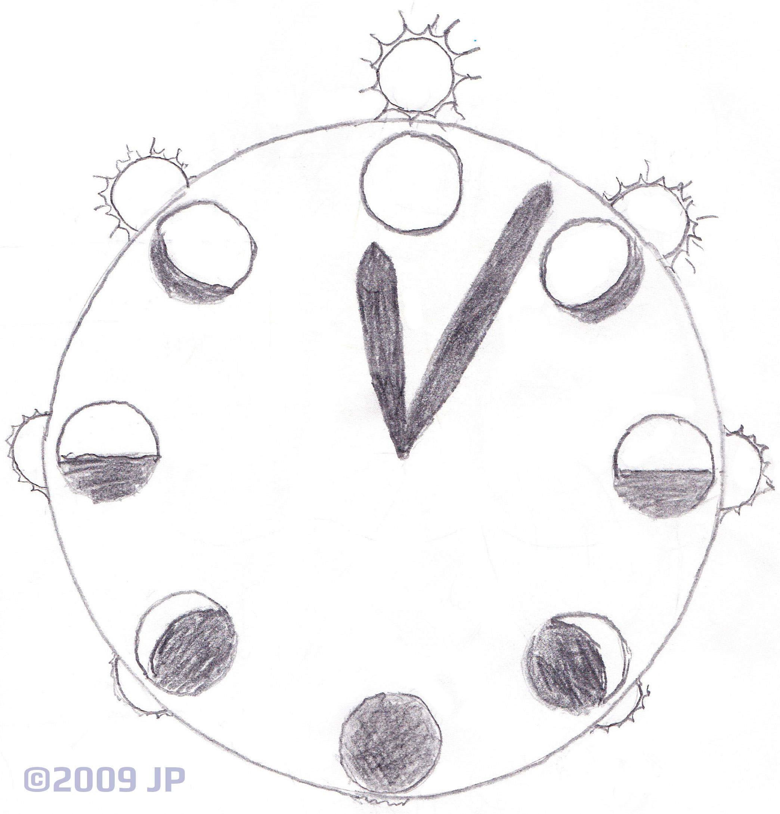
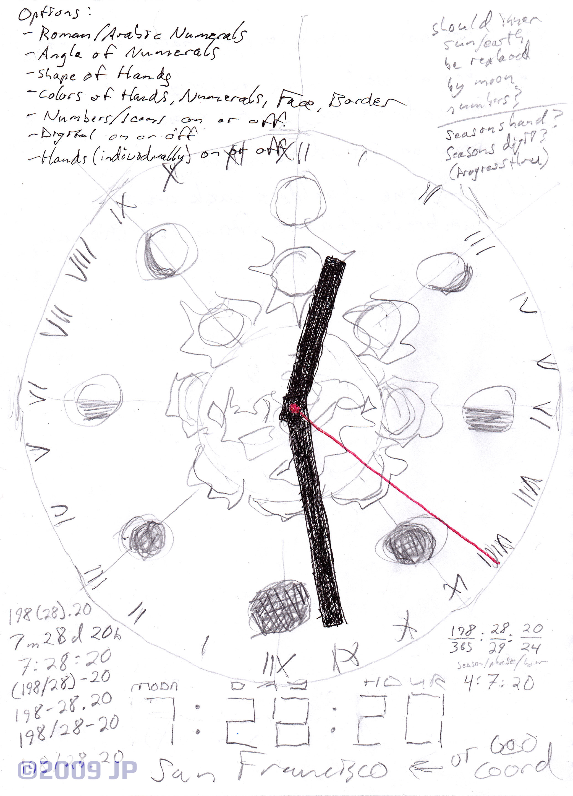

# Lunisolar Calendar-Clock

Analog layering of date and time.

Originally sketched in 2009:

 &#xa0; 

Soon thereafter I created a print version in Illustrator: http://calendardial.info/

Motion version is in progress here.

(c) JP 2009 (concept).
(c) 2018 (code, in progress).
