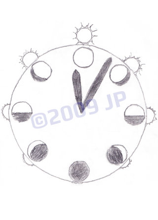

# Date Clock

*Analog layers of date and time. An holistic horologe of cyclic progression.*

This is a single-page, mobile-responsive, statically served, progressive web app, for hosting an interactive analog-clock presentation of date and time.

Concept was first sketched in 2009:

 &#xa0; 

Print version was designed that same year: https://calendardial.net/

Motion version was developed in 2018: https://dateclock.net/
